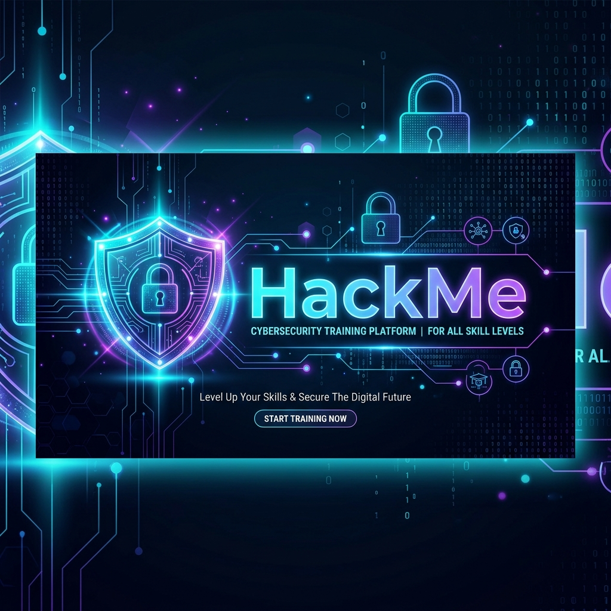

# 🛡️ HackMe - Gamified Cybersecurity Training Platform



Welcome to **HackMe**, a comprehensive graduation project platform designed for practical cybersecurity learning. This platform provides hands-on experience through controlled labs, exploit-driven scenarios, and a real-time progress tracking system.

---

## 🏗️ Project Architecture

The project is split into two main repositories that work together:

1.  **Platform Core (This Repo):** The central hub for user management, leaderboards, scoring, and lab navigation.
2.  **Labs Repository:** A separate repository containing all the containerized labs (SQLi, XSS, CSRF, etc.).

---

## 🚀 Getting Started

To fully set up the platform, you need to follow the installation steps for both the **Platform** and the **Labs**.

### 1️⃣ Part 1: Platform Setup (Main Repository)

This repository contains the Frontend (React), Backend (PHP), and Notification Server (Node.js).

#### Prerequisites
*   **XAMPP / WAMP / LAMP** (PHP 8.1+, MySQL 8.0+)
*   **Node.js** (v18+) & **npm**
*   **Composer** (for PHP dependencies)

#### Installation Steps

1. **Clone the Platform Repository inside XAMPP htdocs**  
   > The project **must** be placed inside: `C:\xampp\htdocs`

2.  **Clone the Platform Repository:**
    ```bash
    git clone https://github.com/Ahmed-Mostafa47/HackMe.git
    cd HackMe
    ```
3.  **Install Frontend Dependencies:**
    ```bash
    npm install
    ```
4.  **Install PHP Dependencies:**
    ```bash
    composer install
    ```
5.  **Configure Environment Variables:**
    *   Rename `.env.example` to `.env`.
    *   Update your Database credentials (`DB_HOST`, `DB_USER`, `DB_PASS`, etc.) with the **Aiven Server** details.
6.  **Database Connection:**
    *   **No local database setup is required.** The platform connects directly to the remote database hosted on Aiven.
    *   Ensure your `.env` contains the correct hostname and port provided by the administrator.
7.  **Configure Labs Path:**
    *   Open `server/core/config/labs_config.php`.
    *   Update the `LABS_BASE_PATH` constant to the absolute path where you cloned the **Labs** repository.
    *   Example: `define('LABS_BASE_PATH', 'C:\path\to\your\Labs');`
8.  **Run the Platform:**
    *   Start the React development server:
        ```bash
        npm run dev
        ```
    *   Start the Identity Server (Required for user authentication in labs):
        ```bash
        npm run identity-server
        ```
    *   *(Optional)* Start the Notification Server:
        ```bash
        cd notification-server
        npm install
        node server.js
        ```

---

### 2️⃣ Part 2: Labs Setup (The "Other" Repository)

The labs are hosted in a separate repository to keep the environment isolated and manageable via Docker.

#### Installation Steps
1.  **Clone the Labs Repository:**
    ```bash
    # Move outside the HackMe directory first
    cd ..
    git clone https://github.com/ABDOHAMDA/Labs.git
    cd Labs
    ```
2.  **Lab Structure & Deployment:**
    Each lab folder contains its own environment. Use the following commands to deploy:
    
    *   **SQL Labs:** 
        ```bash
        cd SQL && docker compose up -d --build
        ```
    *   **XSS Labs:** 
        ```bash
        # Reflected XSS
        cd XSS/reflected-xss-lab && docker compose up -d --build
        # DOM XSS
        cd XSS/dom-xss-select-lab && docker compose up -d --build
        ```
    *   **Broken Authentication (BA):** 
        ```bash
        # Standard BA
        cd BA && docker compose up -d --build
        # Access Control
        cd BA && docker compose -f docker-compose.access-control.yml up -d --build
        ```
    *   **Black Box (Frogger):** 
        ```bash
        cd BLACK_BOX/game && docker compose up -d --build
        ```
    *   **Games:**
        ```bash
        # Hack The Sudoku
        cd Games/hack-the-sudoku && docker compose up -d --build
        # War Game
        cd "Games/War Game" && docker compose up -d --build
        # Maze Master
        cd Games/javascript-videogame-the-maze-master && docker compose up -d --build
        ```
    
3.  **Solving Labs:**
    *   Once the lab is running, it will be accessible at the port specified in `labs_config.php`.
    *   Solve the **challenge** to earn points!

---

## 📁 Project Structure

A comprehensive view of how the platform and labs are organized:

### 🔹 Platform Core (Main Repository)
```text
HackMe/
├── src/                    # Frontend (React + Vite)
│   ├── components/         # Reusable UI components
│   ├── pages/              # Dashboard, Leaderboard, Lab Interface, etc.
│   ├── services/           # API communication layer (Axios)
│   └── context/            # Authentication & Global state management
├── server/                 # Backend (PHP 8.1+)
│   ├── api/                # API Routing & Entry points
│   ├── controllers/        # Request handling logic (Auth, Labs, User, etc.)
│   ├── core/               # Core Framework
│   │   ├── config/         # App, DB, and Labs configurations
│   │   ├── db/             # PDO Database wrapper
│   │   └── utils/          # Global utilities (Response, JWT, Validation)
│   ├── helpers/            # Shared helper functions
│   └── storage/            # Uploads and session logs
├── notification-server/    # Node.js + Socket.io for real-time notifications
└── public/                 # Static assets (Banners, Logos)
```

### 🔹 Labs Repository (Dockerized Environments)
```text
Labs/
├── SQL/                    # SQL Injection Lab [Docker: ./SQL]
├── XSS/                    # Cross-Site Scripting Labs
│   ├── dom-xss-select-lab/ # DOM-based XSS [Docker: ./XSS/dom-xss-select-lab]
│   └── reflected-xss-lab/  # Reflected XSS [Docker: ./XSS/reflected-xss-lab]
├── BA/                     # Broken Authentication & Access Control [Docker: ./BA]
│   ├── docker-compose.yml                  # Default BA Lab
│   └── docker-compose.access-control.yml   # Access Control Lab
├── CSRF/                   # Cross-Site Request Forgery [Docker: ./CSRF]
├── Games/                  # Interactive security games
│   ├── hack-the-sudoku/    # Logic-based puzzle [Docker: ./Games/hack-the-sudoku]
│   ├── War Game/           # Strategy security game [Docker: ./Games/War Game]
│   └── javascript-videogame-the-maze-master/ # Maze Master game
└── BLACK_BOX/              # Advanced Challenge (Frogger Game) [Docker: ./BLACK_BOX/game]
```

---

## 🛠️ Troubleshooting

*   **API Connection Error:** Ensure the `VITE_API_BASE` in your `.env` matches your local server path.
*   **Database Errors:** Verify your internet connection and the Aiven credentials in `.env`. Local MySQL setup is not needed.
*   **Lab Not Accessible:** Ensure Docker Desktop is running and you used the `--build` flag to refresh the container.
*   **Path Issues:** Double-check the `LABS_BASE_PATH` in `labs_config.php`. It must be an absolute path.

---

## 🎓 Contributors
*   **Graduation Project Team** - Faculty of Computer Science.

---

### 🌟 Project Status: Active Development

